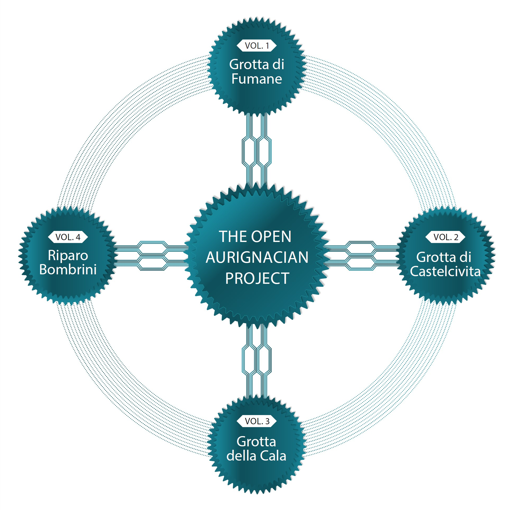

## Research Compendium for 'The Open Aurignacian Project: 3D scanning and the digital preservation of the Italian Paleolithic record'

### Links to the Zenodo datasets:
- [Volume 1: Grotta di Fumane](https://doi.org/10.5281/zenodo.6362149)
- [Volume 2: Grotta di Castelcivita](https://doi.org/10.5281/zenodo.10631389)
- [Volume 3: Grotta della Cala](https://doi.org/10.5281/zenodo.14165189)
- [Volume 4: Riparo Bombrini](https://doi.org/10.5281/zenodo.14731694)

### Compendium DOI:

The content available at the above provided Zenodo DOI reproduces the results as documented in the publication. The files hosted at <https://github.com/ArmandoFalcucci/The-Open-Aurignacian> represent the developmental versions and might have undergone modifications since the paper's publication.

### Maintainer of this Repository:

 **Armando Falcucci** (<armando.falcucci@uni-tuebingen.de>)

### Submitted Paper:

**Armando Falcucci, Adriana Moroni, Fabio Negrino, Marco Peresani, Julien Riel-Salvatore.** *The Open Aurignacian Project: 3D scanning and the digital preservation of the Italian Paleolithic record.* _Journal Name, Volume Number, Page Numbers_ (in preparation). DOI: [Insert DOI]

### Abstract:

Here, we introduce an open-access database of 3D models of stone tools (n = 2,016) from four Early Upper Paleolithic sequences excavated south of the Alps and along Peninsular Italy, including Grotta della Cala, Grotta di Castelcivita, Grotta di Fumane, and Riparo Bombrini. Available through four self-standing Zenodo repositories, these models enable in-depth analysis of core reduction procedures, reduction intensity, and shape variability. Unlike other repositories, this database has been actively used to address archaeological questions, providing a comprehensive demonstration of the use of 3D models in lithic analysis. The Open Aurignacian Project utilizes various scanning devices, including the Artec Spider, Artec Micro, and micro-computed tomography, with a focus on enhancing the reproducibility and accessibility of archaeological data. This paper presents the scanning methodology, dataset organization, and technical validation of the project, while also discussing the scientific potential of these data to foster cross-continental research collaboration. This open-sharing initiative is designed to stimulate inter-regional studies of human behavioral evolution, offering new opportunities to address questions in Paleolithic studies through the FAIR principles.

### Keywords:

3D imaging; Scanning; Cultural Heritage; Early Upper Paleolithic; Lithic Technology.

### Overview of Contents and How to Reproduce:

This repository contains data, code, and output files associated with the paper. The files are organized into the following directories:

- **`data`**: Contains the metadata files for each site.
- **`script`**: Includes the R script for data visualization, as well as the Python scripts used to calculate the average edge length (in mm) and the number of polygons for all 3D meshes.
- **`output`**: Contains the generated outputs for the paper, including figures and tables.

To replicate the results from the paper, follow these steps:

1. Download the entire repository.
2. Open the `The-Open-Aurignacian.Rproj` R project file.
3. Navigate to the `script` folder, where you will find the R and Python scripts for reproducing figures, tables, and measurements.

For consistent results, the `renv` package (v. 1.0.3) was used, following the procedures outlined in its vignette. All analyses were performed using R 4.3.1 on Microsoft Windows 10.0.19045 (64-bit). Necessary packages are provided within the `renv` folder.

## Licenses:

- **Code**: MIT License ([https://opensource.org/licenses/MIT](https://opensource.org/licenses/MIT)), copyright holder: **Armando Falcucci** (2025).
- **Data and Intellectual Work**: Creative Commons Attribution 4.0 International License ([https://creativecommons.org/licenses/by/4.0/](https://creativecommons.org/licenses/by/4.0/)), copyright holder: the authors (2025).
